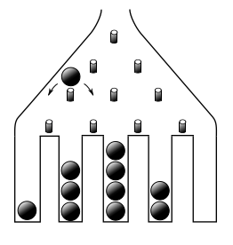
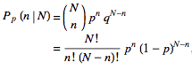

# Simulation-of-Galton-Board-on-Scilab
 [								]

The Galton board, also known as a quincunx or bean machine, is a device for statistical experiments named after English scientist Sir Francis Galton. It consists of an upright board with evenly spaced nails (or pegs) driven into its upper half, where the nails are arranged in staggered order, and a lower half divided into a number of evenly-spaced rectangular slots. The front of the device is covered with a glass cover to allow viewing of both nails and slots. In the middle of the upper edge, there is a funnel into which balls can be poured, where the diameter of the balls must be much smaller than the distance between the nails. The funnel is located precisely above the central nail of the second row so that each ball, if perfectly centered, would fall vertically and directly onto the uppermost point of this nail's surface (Kozlov and Mitrofanova 2002). The figure above shows a variant of the board in which only the nails that can potentially be hit by a ball dropped from the funnel are included, leading to a triangular array instead of a rectangular one. 
	Each time a ball hits one of the nails, it can bounce right (or left) with some probability p (and q = 1- p). For symmetrically placed nails, balls will bounce left or right with equal probability, so p = q = 1/2. If the rows are numbered from 0 to N-1, the path of each falling ball is a Bernoulli trial consisting of N steps. Each ball crosses the bottom row hitting the nth peg from the left (where 0 ≤ n ≤ N-1) iff it has taken exactly n right turns, which occurs with probability 
                                              

                                              
